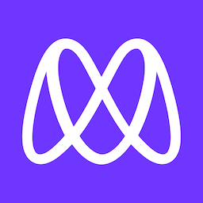

<!--
HOW TO USE:
This is an example of how you may give instructions on setting up your project locally.

Modify this file to match your project and remove sections that don't apply.

REQUIRED SECTIONS:
- Table of Contents
- About the Project
  - Built With
  - Live Demo
- Getting Started
- Authors
- Future Features
- Contributing
- Show your support
- Acknowledgements
- License

OPTIONAL SECTIONS:
- FAQ

After you're finished please remove all the comments and instructions!
-->

  <!-- You are encouraged to replace this logo with your own! Otherwise you can also remove it. -->
  
   

  <h3><b>Hello Microverse</b></h3>

<!-- TABLE OF CONTENTS -->

# 📗 Table of Contents

- [📖 About the Project](#about-project)
  - [🛠 Built With](#built-with)
    - [Tech Stack](#tech-stack)
    - [Key Features](#key-features)
  - [🚀 Live Demo](#live-demo)
- [💻 Getting Started](#getting-started)
  - [Setup](#setup)
  - [Prerequisites](#prerequisites)
  - [Deployment](#deployment)
- [👥 Authors](#authors)
- [🤝 Contributing](#contributing)
- [⭐️ Show your support](#support)
- [🙏 Acknowledgements](#acknowledgements)
- [❓ FAQ (OPTIONAL)](#faq)
- [📝 License](#license)

<!-- PROJECT DESCRIPTION -->

# 📖 [Hello Microverse Project] 

> Describe your project in 1 or 2 sentences.

**[Hello Microverse]** is a simple project to help me to get familiar with the basic tools I needed to learn and put into practice in this project

## 🛠 Built With 

### Tech Stack 

> Describe the tech stack and include only the relevant sections that apply to your project.

  
Client

  <ul>
    <li><a href="https://html.com/">HTML</a></li>
    <li><a href="https://www.css3.com/">CSS</a></li>
  </ul>

<!-- Features -->

### Key Features 

> Describe between 1-3 key features of the application.

- **[Display header with a red text "Hello Microverse!"]**

(<a href="#readme-top">back to top</a>)

<!-- LIVE DEMO -->

## 🚀 Live Demo 

> Add a link to your deployed project.

- [Live Demo Link](https://peteryeungtt.github.io/Hello-world/)

(<a href="#readme-top">back to top</a>)

<!-- GETTING STARTED -->

## 💻 Getting Started 

> Describe how a new developer could make use of your project.

To get a local copy up and running, follow these steps.

### Prerequisites

In order to run this project you need:
Install Git Bash, Web browser and code editor

### Setup

Clone this repository to your desired folder:
cd my-folder
git clone git@github.com:myaccount/https://github.com/peteryeungtt/Hello-world.git

### Deployment

You can deploy this project using:
Web Browser

(<a href="#readme-top">back to top</a>)

<!-- AUTHORS -->

## 👥 Authors 

> Mention all of the collaborators of this project.

👤 **Author**

- GitHub: [@peteryeuntt](https://github.com/peteryeungtt)
- Twitter: [@Peter](https://twitter.com/PeterYeungJW)
- LinkedIn: [LinkedIn](https://www.linkedin.com/in/peter-yeung-1a7251260/)

(<a href="#readme-top">back to top</a>)

<!-- CONTRIBUTING -->

## 🤝 Contributing 

Contributions, issues, and feature requests are welcome!

Feel free to check the [issues page](../../issues/).

(<a href="#readme-top">back to top</a>)

<!-- SUPPORT -->

## ⭐️ Show your support 

> Write a message to encourage readers to support your project

If you like this project...

(<a href="#readme-top">back to top</a>)

<!-- ACKNOWLEDGEMENTS -->

## 🙏 Acknowledgments 

> Give credit to everyone who inspired your codebase.

I would like to thank...

(<a href="#readme-top">back to top</a>)

<!-- FAQ (optional) -->

## ❓ FAQ (OPTIONAL) 

> Add at least 2 questions new developers would ask when they decide to use your project.

- **[Why to use this project?]**

  - [To get familair with HTML, CSS and Linters]

- **[Is there any JS fromwork used in this project]**

  - [No, just plain HTML and CSS]

(<a href="#readme-top">back to top</a>)

<!-- LICENSE -->

## 📝 License 

This project is [MIT](https://github.com/peteryeungtt/Hello-world/blob/add-homepage/LICENSE.md) licensed.

(<a href="#readme-top">back to top</a>)

